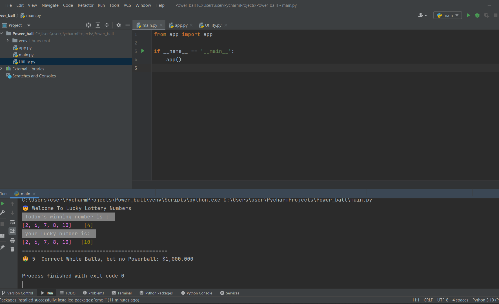

# Power_ball
>>Author: Belay Emanuel 
# This Python Programing Project Is All About Powerball

>: This project is implemented in OOP & I have used Multilevel Inheritance in this project  

* I have created my main folder called "Powerball" And I have and also created 3 sub_folders called 

                 
                  1,main          2,app       3,utility

* In the main folder I assigned the main to be the main house for the project and connected it to the app folder to run all the utilitys.

* I also used Color and emoji Packages on this project.

* On the utilitys I have 3 classes and the methodology I used is Inheritance and the Type is Multilevel Inheritance.

* This project takes me a week to finish and I have used as a guide google and udemy .com.

>: About Powerball.

* The Powerball game in this assignment works differently from the real one like Mega Millions to get more chances to get favorite results.

* The Powerball game includes two parts. 

>>Part one includes 5 numbers. These five numbers are white ball numbers, which are drawn randomly from 20 numbers from 1 to 20 inclusively - (1,2,3, 4, 5, … , 17,18,19, 20). 
 
>>Part two only has one number, the Powerball number, which is obtained randomly from 10 numbers (1,2,3,4, 5,6,7,8, 9,10).
 

* When your program/page is run or reloaded/refreshed, it would display today’s Powerball winning numbers, your lucky numbers, and display the result based on your lucky numbers against Today’s Powerball winning numbers.

* And the result will be displayed based on your lucky numbers and winning numbers.

>>Key Words:
> 
> Today_num = The generated number of Today's White ball
> 
> Lucky_num = The generated number of Your Luckiest White ball
>
> Today's_num_powerball = The generated number of Today's Power ball
> 
> Lucky_num_powerball = The generated number of Your Luckiest power ball
> 
> correct_numbers = to show the similar number from the 2 white balls
>
> correct_numbers2 = to show the similar number from the 2 power balls

>>>Thank you. Enjoy!